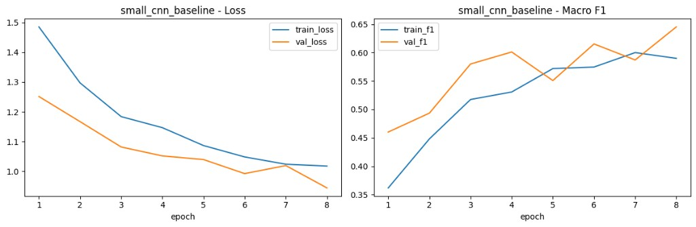
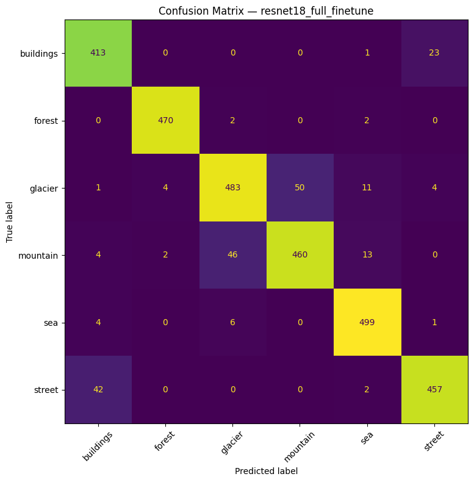
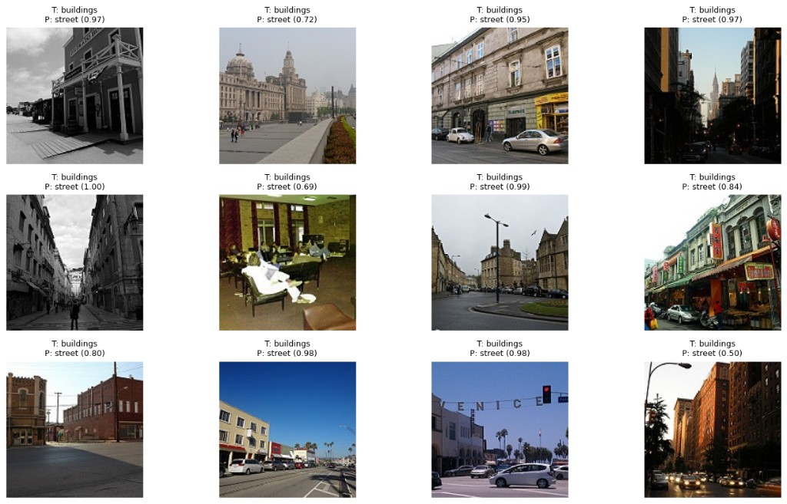

# Intel Image Classification Research

Исследование методов обучения CNN для классификации изображений в условиях ограниченного объёма данных (small-data regime).

## Задача

Классифицировать изображения на 6 классов:
- buildings
- forest
- glacier
- mountain
- sea
- street

## Подход

В проекте сравниваются различные стратегии обучения:

- обучение CNN с нуля (baseline)
- transfer learning с ResNet18:
  - frozen (замороженный backbone)
  - partial unfreeze (частичное размораживание)
  - full fine-tuning (обучение всей модели)

Цель — определить, какая стратегия даёт наилучшее качество при ограниченном объёме данных.

## Данные и настройки

- train fraction: 35% от исходного датасета  
- validation: 15%  
- image size: 224×224  
- batch size: 64  
- seed: 42  

## Эксперименты

| experiment                     | model      | strategy | val_acc | val_f1 |
|--------------------------------|------------|----------|---------|--------|
| resnet18_full_finetune         | resnet18   | full     | 0.9330  | 0.9339 |
| resnet18_partial_unfreeze      | resnet18   | partial  | 0.9231  | 0.9238 |
| resnet18_frozen                | resnet18   | frozen   | 0.8917  | 0.8935 |
| deep_cnn_bn_aug                | custom CNN | -        | 0.7730  | 0.7741 |
| small_cnn_baseline             | custom CNN | -        | 0.6467  | 0.6454 |

## Лучший результат

- модель: **resnet18_full_finetune**
- test accuracy: **0.9273**
- macro F1: **0.9283**

## Визуализации

### Learning curves (`small_cnn_baseline`)



### Confusion matrix (`resnet18_full_finetune`)



### Misclassified examples (`resnet18_full_finetune`)



## Выводы

- Переход от обучения с нуля к transfer learning дает существенный прирост качества в small-data режиме.
- `resnet18_frozen` уже значительно превосходит обе CNN-модели.
- `resnet18_partial_unfreeze` дополнительно увеличивает качество.
- Максимальные метрики достигаются при `resnet18_full_finetune`.
- Ошибки преимущественно наблюдаются в визуально близких классах: `glacier`/`mountain`, `buildings`/`street`.

## Доступные артефакты в репозитории

- `artifacts/results_summary.csv`
- `artifacts/best_model_classification_report.csv`
- `artifacts/figures/small_cnn_baseline_learning_curves.png`
- `artifacts/figures/resnet18_full_finetune_confusion_matrix.png`
- `artifacts/figures/resnet18_full_finetune_misclassified_examples.png`

## Запуск служебных скриптов

```bash
python generate_artifacts.py
python scripts/dataset_audit.py
```

## Структура проекта

```text
.
├── README.md
├── .gitignore
├── generate_artifacts.py
├── artifacts/
│   ├── results_summary.csv
│   ├── best_model_classification_report.csv
│   └── figures/
│       ├── small_cnn_baseline_learning_curves.png
│       ├── resnet18_full_finetune_confusion_matrix.png
│       └── resnet18_full_finetune_misclassified_examples.png
├── scripts/
│   └── dataset_audit.py
└── seg_pred/
    └── *.jpg (7301 files)
```
